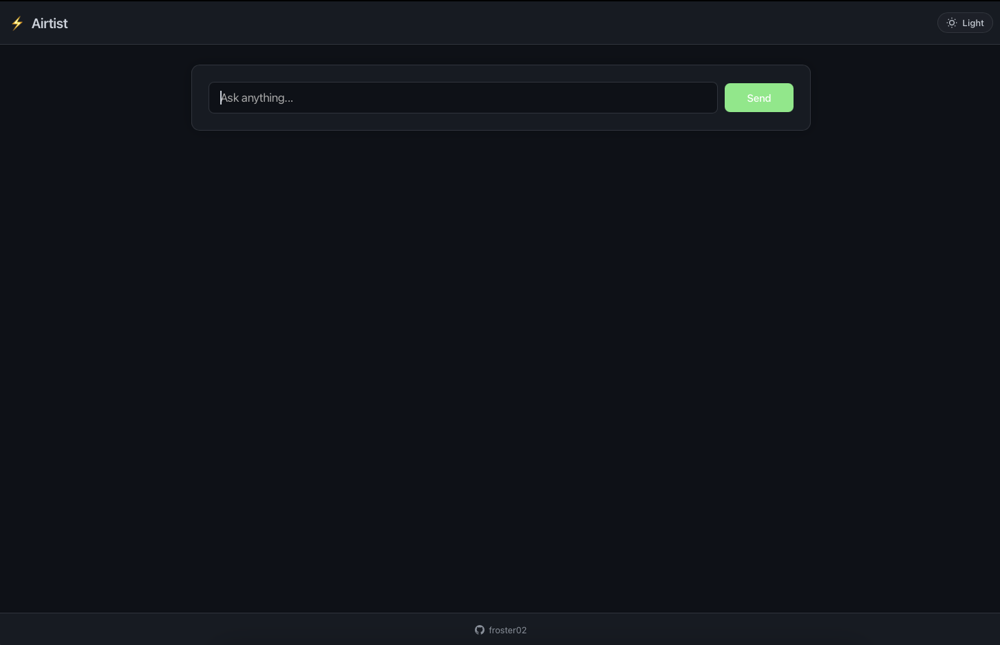

# Airtist - AI Chat Assistant

A modern AI chat interface powered by Mistral-7B, featuring a clean GitHub Copilot-inspired design. Built with React and Node.js, this application provides real-time AI responses with a focus on developer experience.



## 🎯 Features

- 🤖 Mistral-7B AI model integration
- 🌓 Dark/Light theme switching
- 💻 Code syntax highlighting
- ⌨️ Keyboard shortcuts
- 📱 Responsive design
- ⚡ Real-time streaming responses
- 🎨 Minimal, clean interface

## 🚀 Installation

### Prerequisites

- Node.js 14.0 or later
- npm 6.0 or later
- Together AI API key ([Get yours here](https://together.ai))

### Backend Setup

1. Clone the repository:

```bash
git clone https://github.com/yourusername/airtist.git
cd airtist
```

2. Install backend dependencies:

```bash
cd server
npm install
```

3. Create a `.env` file in the server directory:

```bash
TOGETHER_API_KEY=your_api_key_here
PORT=3001
```

4. Start the backend server:

```bash
npm run dev
```

### Frontend Setup

1. Open a new terminal and navigate to the frontend directory:

```bash
cd ../client
```

2. Install frontend dependencies:

```bash
npm install
```

3. Create a `.env` file in the client directory:

```bash
VITE_API_URL=http://localhost:3001
```

4. Start the frontend development server:

```bash
npm run dev
```

The application will be available at `http://localhost:5173`

## 🛠️ Tech Stack

- **Frontend**
  - React with TypeScript
  - Vite
  - TailwindCSS
  - CodeMirror for code highlighting
  - React Query for API management

- **Backend**
  - Node.js
  - Express
  - Together AI API
  - Socket.io for real-time communication

## ⌨️ Keyboard Shortcuts

- `Cmd/Ctrl + Enter`: Submit message
- `Cmd/Ctrl + K`: Focus chat input
- `Cmd/Ctrl + L`: Clear chat
- `Cmd/Ctrl + D`: Toggle theme

## 📝 Environment Variables

### Backend (.env)

```
TOGETHER_API_KEY=your_api_key_here
PORT=3001
```

### Frontend (.env)

```
VITE_API_URL=http://localhost:3001
```

## 🤝 Contributing

1. Fork the repository
2. Create your feature branch (`git checkout -b feature/amazing-feature`)
3. Commit your changes (`git commit -m 'Add some amazing feature'`)
4. Push to the branch (`git push origin feature/amazing-feature`)
5. Open a Pull Request

## 📄 License

This project is licensed under the MIT License - see the [LICENSE](LICENSE) file for details.
